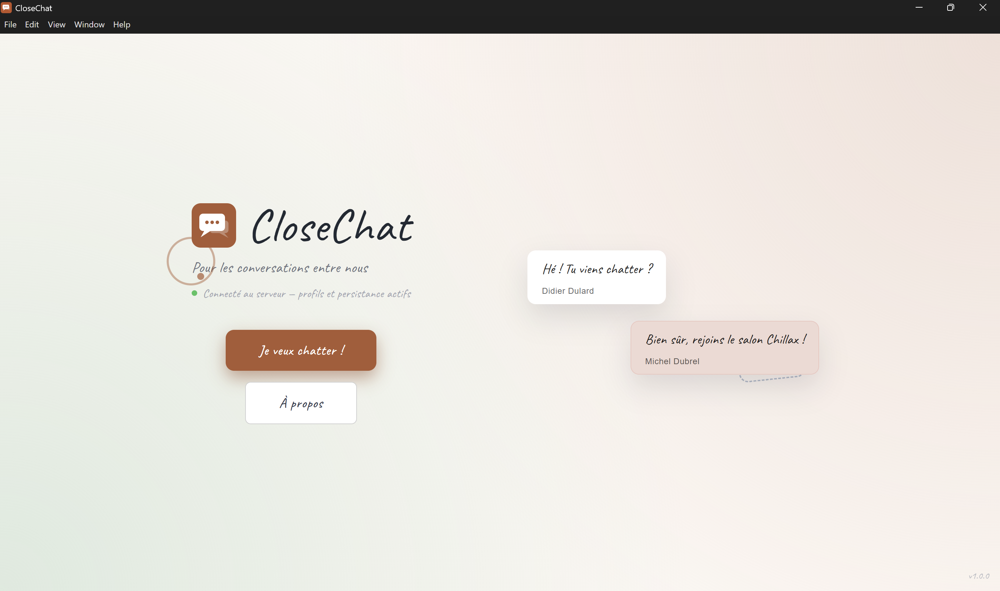
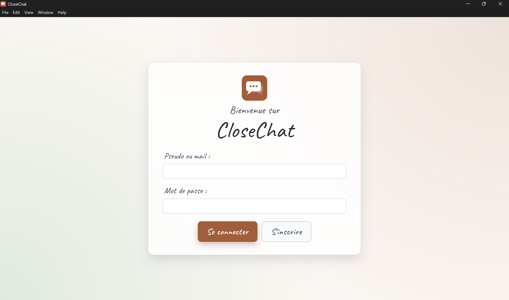
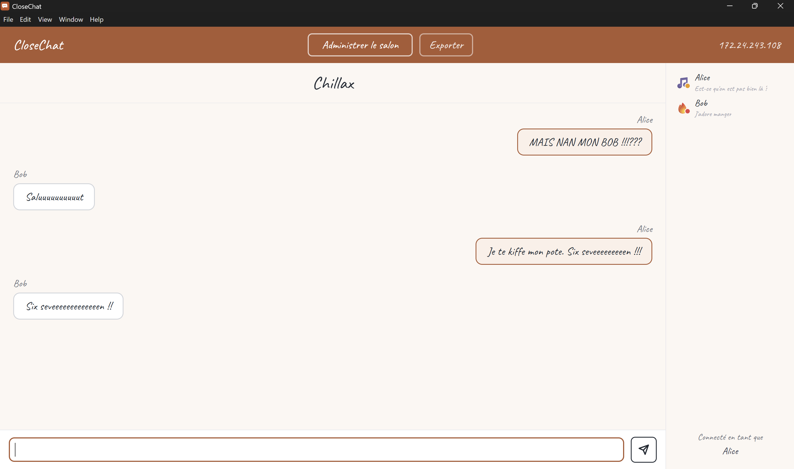
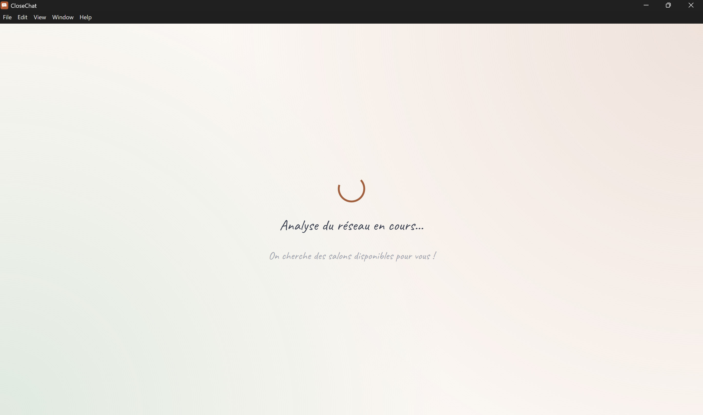
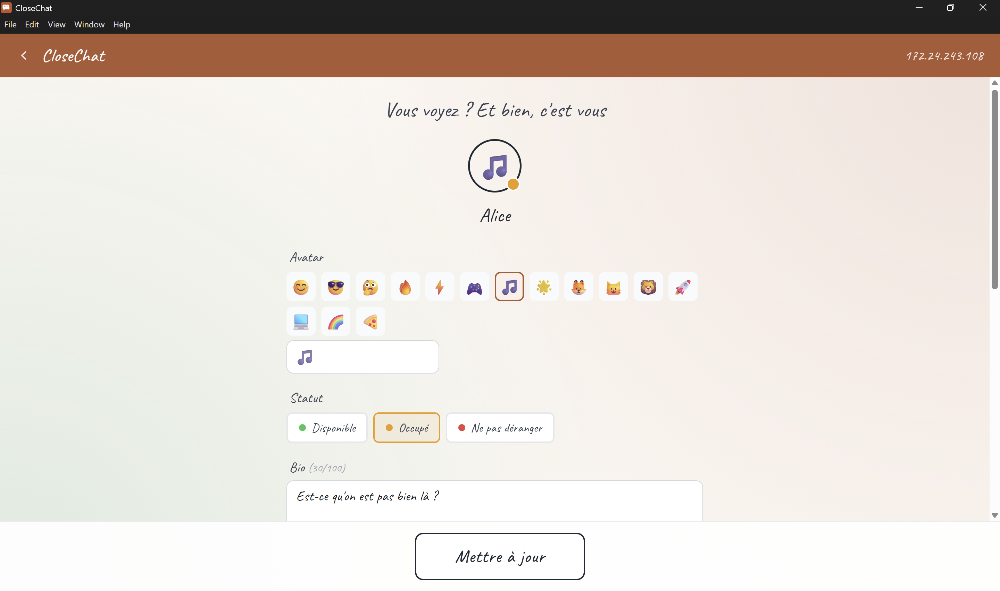
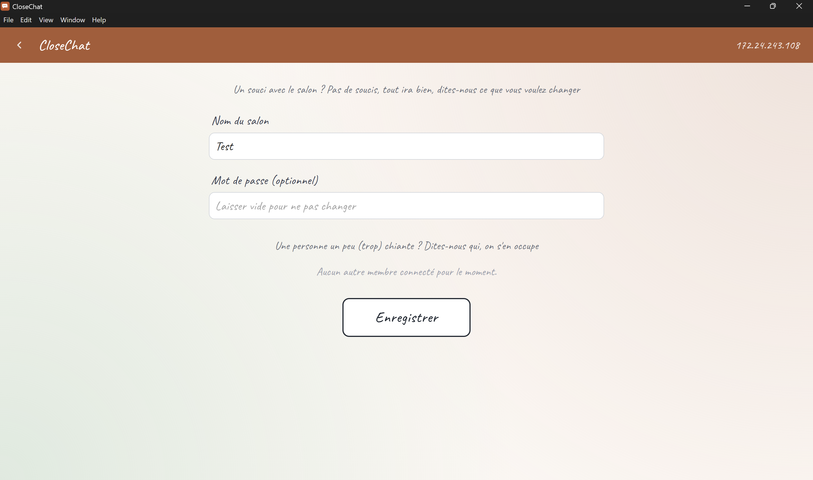

<div align="center">
  
  <h1>CloseChat</h1>
  <p><em>Pour les conversations entre nous.</em></p>

  
  
  
  
  
</div>

---

CloseChat est une application de chat **en réseau local** pensée pour les petits groupes — entre amis, en classe, en LAN party. Pas de compte obligatoire, pas d'internet, pas d'algorithme : juste vous et les gens autour de vous.

## ✨ Fonctionnalités

- 💬 **Chat temps réel** via WebSocket sur le réseau local (port 5050)
- 🔍 **Découverte automatique** des salons disponibles sur le /24
- 🔐 **Authentification JWT RS256** — avec compte (API) ou sans (token local)
- 👤 **Profils personnalisés** — avatar emoji, statut, bio — synchronisés en temps réel
- ⚙️ **Panel d'administration** — renommer le salon, exclure ou bannir des membres
- 🔔 **Notifications push** natives (si l'app n'est pas au premier plan)
- 📥 **System tray** — l'app reste accessible depuis la zone de notification
- 🚀 **Démarrage automatique** au login système
- 💾 **Export de conversation** en `.txt` via dialog natif
- 🐛 **Crash reporter** — collecte automatique des erreurs (main + renderer + backend)

## 📸 Aperçu

| Accueil | Connexion | Chat |
|:---:|:---:|:---:|
|  |  |  |

| Découverte | Profil | Administration |
|:---:|:---:|:---:|
|  |  |  |

## 🛠️ Stack technique

| Couche | Technologie |
|---|---|
| Desktop | Electron 41, React 19, MUI v6, Vite, TypeScript |
| Temps réel | WebSocket (`ws`) — port 5050 |
| Backend | Node.js, Express, PostgreSQL 16 |
| Auth | JWT RS256, bcrypt (cost 12) |
| Infra | Docker Compose, electron-builder |

## 🚀 Démarrage rapide

### Prérequis

- [Node.js](https://nodejs.org) 20+
- [Docker](https://www.docker.com) + Docker Compose

### 1. Cloner le repo

```bash
git clone https://github.com/Inkflow59/CloseChat.git
cd CloseChat
```

### 2. Lancer le backend (API + base de données)

```bash
docker-compose up --build -d
```

L'API sera disponible sur `http://localhost:6767`.  
La base de données est initialisée automatiquement depuis `db/db.sql`.

> **Comptes de test** : `Alice` / `Bob` — mot de passe : `test1234`

### 3. Lancer l'app desktop

```bash
cd desktop
npm install
npm run dev
```

L'app Electron s'ouvre automatiquement. En mode hors ligne (sans Docker), le login génère un token local.

## 📦 Build & distribution

### Générer les icônes

```bash
cd desktop
npm run build:icons
```

### Créer l'installeur Windows

```bash
npm run dist
```

Produit dans `desktop/dist/installer/` :
- `CloseChat Setup 1.0.0.exe` — installeur NSIS
- `CloseChat-1.0.0-win.zip` — archive portable (Scoop)

### Installer via Scoop

```powershell
scoop bucket add inkflow https://github.com/Inkflow59/scoop-bucket
scoop install inkflow/closechat
```

## 🏗️ Architecture

```
CloseChat/
├── api/                  # Backend Express (auth, profils, crash reporter)
│   └── src/
│       ├── app.js
│       ├── authRoutes.js
│       ├── profileRoutes.js
│       └── crashRoutes.js
├── db/
│   └── db.sql            # Schéma PostgreSQL + données de test
├── desktop/
│   ├── src/
│   │   ├── main/
│   │   │   ├── electron.js   # Process principal (IPC, WS, tray, OS)
│   │   │   └── preload.js    # Bridge contextBridge → renderer
│   │   └── renderer/src/
│   │       ├── pages/        # 8 écrans (Home, Login, Chat, …)
│   │       └── components/   # AccountPanel, AdminPanel, …
│   └── resources/        # Icônes (PNG, ICO)
├── presentation/         # Slides Slidev
├── scoop/
│   └── closechat.json    # Manifest Scoop
└── docker-compose.yml
```

## 🔑 Clés JWT

Au premier lancement, l'app génère automatiquement une paire de clés RSA dans `%APPDATA%/CloseChat/secrets/` (production) ou `secrets/` (développement). Ces fichiers sont exclus du dépôt (`.gitignore`).

## 📋 Présentation

La présentation du projet est disponible dans `presentation/` (Slidev).

```bash
cd presentation
npm install
npm run dev   # http://localhost:3030
```

## 📄 Licence

ISC © [Inkflow59](https://github.com/Inkflow59)
