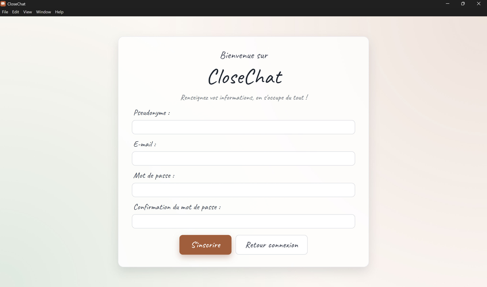
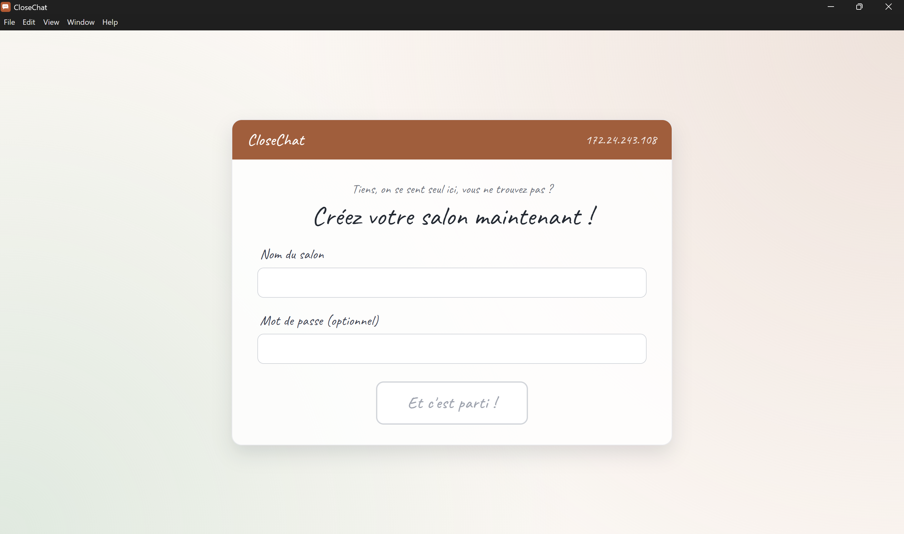
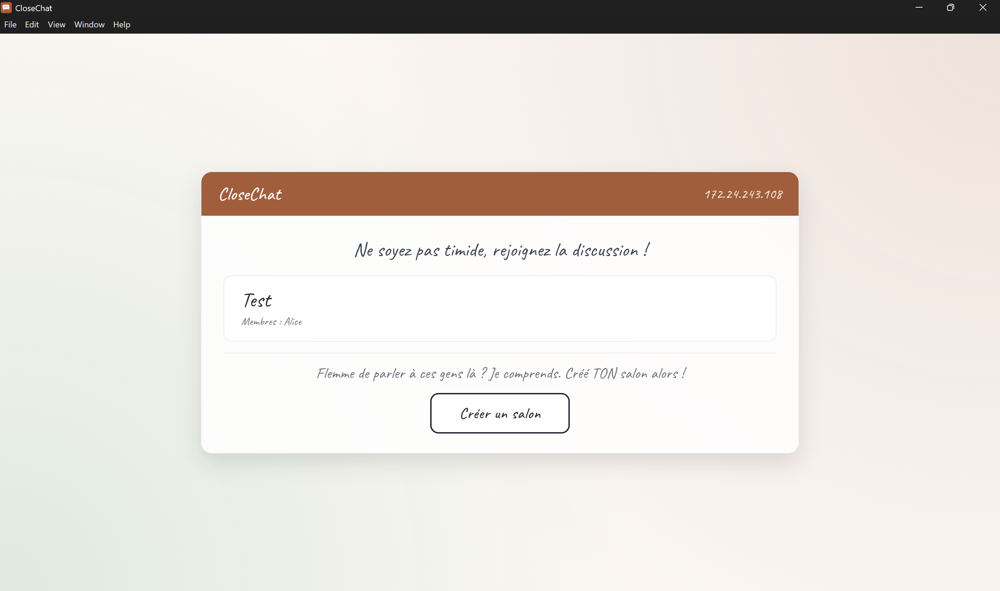

<div class="flex flex-col items-center gap-4">
  
  <h1 style="font-size:5rem; color:#1f2933; margin:0">CloseChat</h1>
  <p style="color:#6b7280; font-size:1.8rem; margin:0">Pour les conversations entre nous</p>
  <div class="flex gap-3 mt-2 flex-wrap justify-center">
    <span class="chip">Electron</span>
    <span class="chip">React</span>
    <span class="chip">PostgreSQL</span>
    <span class="chip">WebSocket</span>
  </div>
</div>

---

# C'est quoi CloseChat ?

<div style="display:grid; grid-template-columns:1fr 1fr; gap:24px; margin-top:20px; align-items:stretch">
  <div style="display:flex; flex-direction:column; gap:16px">
    <div class="card" style="flex:1">
      <h3>💬 Le concept</h3>
      Une application de chat <strong>locale</strong> pensée pour les petits groupes — entre amis, en classe, en LAN party.<br/><br/>
      Pas d'internet requis. Pas d'algorithme. Juste vous et les gens qui comptent.
    </div>
    <div class="card" style="flex:1">
      <h3>🎯 Le problème résolu</h3>
      Les apps de chat classiques demandent un compte, une connexion internet, et collectent vos données.<br/><br/>
      CloseChat fonctionne <strong>en réseau local</strong> — vos conversations restent entre vous.
    </div>
  </div>
  <div style="display:flex; align-items:center">
    
  </div>
</div>

---

# Architecture technique

<div style="display:grid; grid-template-columns:1fr 1fr 1fr; gap:16px; margin-top:24px">
  <div class="card" style="text-align:center">
    <h3>🖥️ Desktop</h3>
    <strong>Electron v41</strong><br/>React 19 + MUI v6<br/>Vite + TypeScript
  </div>
  <div class="card" style="text-align:center">
    <h3>⚙️ Backend</h3>
    <strong>Node.js + Express</strong><br/>PostgreSQL via <code>pg</code><br/>JWT RS256 + bcrypt
  </div>
  <div class="card" style="text-align:center">
    <h3>🔗 Temps réel</h3>
    <strong>WebSocket (ws)</strong><br/>Port 5050 (LAN)<br/>Scan /24 automatique
  </div>
</div>

<div class="card" style="margin-top:16px">
  <pre style="margin:0; font-family:'Fira Code',monospace; font-size:0.85rem; color:#1f2933; background:transparent; white-space:pre">Electron (main) ←── IPC ──→ Renderer (React)
     │
     ├── WS Server (hôte)   ←── broadcast messages, profils, présence
     └── WS Client (invité) ──→ POST /crash | PUT /profile | POST /auth/login
                                           API Express :6767</pre>
</div>

---

# Maquette et design

<div class="card" style="margin-top:16px; padding:12px; overflow:hidden">
  
</div>

---

# Les 8 écrans

<div style="display:grid; grid-template-columns:repeat(4,1fr); gap:10px; margin-top:12px; max-width:900px; margin-left:auto; margin-right:auto">
  <div style="display:flex; flex-direction:column; gap:6px; align-items:center">
    
    <span style="font-size:0.82rem; color:#374151; text-align:center">🏠 Accueil</span>
  </div>
  <div style="display:flex; flex-direction:column; gap:6px; align-items:center">
    
    <span style="font-size:0.82rem; color:#374151; text-align:center">🔐 Connexion</span>
  </div>
  <div style="display:flex; flex-direction:column; gap:6px; align-items:center">
    
    <span style="font-size:0.82rem; color:#374151; text-align:center">✍️ Inscription</span>
  </div>
  <div style="display:flex; flex-direction:column; gap:6px; align-items:center">
    
    <span style="font-size:0.82rem; color:#374151; text-align:center">🔍 Découverte</span>
  </div>
  <div style="display:flex; flex-direction:column; gap:6px; align-items:center">
    
    <span style="font-size:0.82rem; color:#374151; text-align:center">➕ Créer salon</span>
  </div>
  <div style="display:flex; flex-direction:column; gap:6px; align-items:center">
    
    <span style="font-size:0.82rem; color:#374151; text-align:center">📋 Liste salons</span>
  </div>
  <div style="display:flex; flex-direction:column; gap:6px; align-items:center">
    
    <span style="font-size:0.82rem; color:#374151; text-align:center">💬 Chat</span>
  </div>
  <div style="display:flex; flex-direction:column; gap:6px; align-items:center">
    
    <span style="font-size:0.82rem; color:#374151; text-align:center">👤 Compte</span>
  </div>
</div>

---

# Panel d'administration

<div style="display:grid; grid-template-columns:1fr 1fr; gap:24px; margin-top:20px; align-items:center">
  <div>
    
  </div>
  <div style="display:flex; flex-direction:column; gap:16px">
    <div class="card">
      <h3>⚙️ Accessible à l'hôte uniquement</h3>
      Le bouton "Administrer le salon" n'apparaît que pour celui qui a créé le salon.
    </div>
    <div class="card">
      <h3>🔧 Fonctionnalités</h3>
      <ul style="margin-top:8px; padding-left:18px">
        <li>Renommer le salon</li>
        <li>Changer le mot de passe</li>
        <li>Exclure un membre</li>
        <li>Bannir un membre</li>
      </ul>
    </div>
  </div>
</div>

---

# CRUD — Les profils utilisateur

<div style="display:grid; grid-template-columns:1fr 1fr; gap:24px; margin-top:16px; align-items:start">
  <div style="display:flex; flex-direction:column; gap:14px">
    <div class="card">
      <h3 style="margin-bottom:8px">Ce qu'on stocke</h3>

| Champ | Exemple |
|---|---|
| `avatar_emoji` | 🦊 😎 🚀 |
| `status` | available / busy / dnd |
| `bio` | "En deux mots, qui êtes-vous ?" |

</div>
    <div class="card">
      <h3 style="margin-bottom:8px">Endpoints</h3>

```http
GET  /profile/me        → profil connecté
GET  /profile/:username → profil public
PUT  /profile           → modifier
DELETE /profile         → réinitialiser
```

</div>
  </div>
  <div style="display:flex; flex-direction:column; gap:14px">
    
    <div class="card" style="font-size:0.9rem">
      Sync <strong>offline-first</strong> : <code>isPersisted</code> dans localStorage — les modifs en attente sont envoyées à l'API au prochain login.
    </div>
  </div>
</div>

---

# Authentification

<div style="display:grid; grid-template-columns:1fr 1fr; gap:24px; margin-top:16px; align-items:stretch">
  <div style="display:flex; flex-direction:column; gap:14px">
    <div class="card" style="flex:1">
      <h3>Mode connecté (API up)</h3>
      <ul style="margin-top:8px; padding-left:18px">
        <li>Inscription : <code>bcrypt</code> (cost 12) + PostgreSQL</li>
        <li>Login insensible à la casse (<code>lower()</code>)</li>
        <li>Token <strong>JWT RS256</strong> signé par le backend</li>
        <li>Mauvais mot de passe → erreur, pas de fallback</li>
      </ul>
    </div>
    <div class="card" style="flex:1">
      <h3>Mode hors ligne (API down)</h3>
      <ul style="margin-top:8px; padding-left:18px">
        <li>Clé RSA générée au <strong>1er lancement</strong> dans <code>userData</code></li>
        <li>Token JWT signé <strong>localement</strong></li>
        <li>Permet de rejoindre un salon LAN sans compte</li>
      </ul>
    </div>
  </div>
  <div style="display:flex; align-items:center">
    
  </div>
</div>

---

# Fonctionnalités natives OS

<div style="display:grid; grid-template-columns:1fr 1fr; gap:16px; margin-top:20px">
  <div class="card">
    <h3>🔔 Notifications push</h3>
    Déclenchées sur nouveau message ou changement de salon, uniquement si l'app n'est pas au premier plan.
  </div>
  <div class="card">
    <h3>📥 Zone de notification (Tray)</h3>
    Icône persistante avec menu contextuel. Croix → réduit dans le tray. Double-clic → restaure.
  </div>
  <div class="card">
    <h3>🚀 Démarrage automatique</h3>
    Toggle dans le panneau Compte, synchronisé avec le menu tray via <code>app.setLoginItemSettings()</code>.
  </div>
  <div class="card">
    <h3>💾 Export de conversation</h3>
    <code>dialog.showSaveDialog()</code> — sauvegarde l'historique du chat en <code>.txt</code> au chemin choisi par l'utilisateur.
  </div>
</div>

---

# Crash Reporter

<div style="display:grid; grid-template-columns:1fr 1fr 1fr; gap:16px; margin-top:24px">
  <div class="card" style="text-align:center">
    <h3>💥 Main process</h3>
    <code>uncaughtException</code><br/>
    <code>unhandledRejection</code><br/><br/>
    → <code>POST /crash</code>
  </div>
  <div class="card" style="text-align:center">
    <h3>🌐 Renderer</h3>
    <code>window.error</code><br/>
    <code>unhandledrejection</code><br/><br/>
    → IPC → <code>POST /crash</code>
  </div>
  <div class="card" style="text-align:center">
    <h3>🗃️ Backend</h3>
    Table <code>crash_reports</code><br/><br/>
    <code>exception, stack,<br/>platform, app_version,<br/>process_type</code>
  </div>
</div>

<div class="card" style="margin-top:16px">
  <pre style="margin:0; font-family:'Fira Code',monospace; font-size:0.88rem; color:#1f2933; background:transparent; white-space:pre">crashReporter.start(<span style="color:#b25a33">{ submitURL, uploadToServer: true }</span>)
<span style="color:#9ca3af">// Capture aussi les crashs natifs (segfaults, out-of-memory…)</span></pre>
</div>

---

# Installeur & Distribution

<div style="display:grid; grid-template-columns:1fr 1fr; gap:24px; margin-top:20px">
  <div class="card">

<h3>📦 electron-builder</h3>
    <pre style="margin:8px 0; font-family:'Fira Code',monospace; font-size:0.88rem; color:#1f2933; background:rgba(178,90,51,0.06); border-radius:8px; padding:10px 14px; white-space:pre">npm run dist</pre>
    <ul style="margin-top:10px; padding-left:18px">
      <li><code>CloseChat Setup 1.0.0.exe</code> — installeur NSIS, choix du dossier, raccourcis bureau &amp; menu démarrer</li>
      <li><code>CloseChat-1.0.0-win.zip</code> — archive portable pour Scoop</li>
    </ul>
  </div>
  <div class="card">
    <h3>🍺 Scoop (Windows)</h3>
    <pre style="margin:8px 0; font-family:'Fira Code',monospace; font-size:0.82rem; color:#1f2933; background:rgba(178,90,51,0.06); border-radius:8px; padding:10px 14px; white-space:pre">scoop bucket add inkflow \
  https://github.com/Inkflow59/scoop-bucket
scoop install inkflow/closechat</pre>
    <ul style="margin-top:10px; padding-left:18px">
      <li>Hash SHA256 vérifié automatiquement</li>
      <li><code>autoupdate</code> sur chaque GitHub Release</li>
    </ul>

  </div>
</div>

---
layout: center
---

<div style="display:flex; flex-direction:column; align-items:center; gap:20px">
  
  <h1 style="font-size:4.5rem; color:#1f2933; margin:0">Merci !</h1>
  <p style="color:#6b7280; font-size:1.6rem; margin:0">Des questions ?</p>
  <span class="chip" style="font-size:1rem">github.com/Inkflow59/CloseChat</span>
  <div style="display:grid; grid-template-columns:repeat(4,1fr); gap:16px; margin-top:8px">
    <div style="background:rgba(255,255,255,0.85); border:1px solid rgba(229,231,235,0.9); border-radius:12px; padding:16px; box-shadow:0 4px 12px rgba(17,24,39,0.06); display:flex; flex-direction:column; align-items:center; justify-content:center; height:90px">
      <div style="font-size:2rem; font-weight:700; color:#b25a33; line-height:1">8</div>
      <div style="color:#6b7280; margin-top:6px">écrans</div>
    </div>
    <div style="background:rgba(255,255,255,0.85); border:1px solid rgba(229,231,235,0.9); border-radius:12px; padding:16px; box-shadow:0 4px 12px rgba(17,24,39,0.06); display:flex; flex-direction:column; align-items:center; justify-content:center; height:90px">
      <div style="font-size:2rem; font-weight:700; color:#b25a33; line-height:1">4</div>
      <div style="color:#6b7280; margin-top:6px">fonctions OS</div>
    </div>
    <div style="background:rgba(255,255,255,0.85); border:1px solid rgba(229,231,235,0.9); border-radius:12px; padding:16px; box-shadow:0 4px 12px rgba(17,24,39,0.06); display:flex; flex-direction:column; align-items:center; justify-content:center; height:90px">
      <div style="font-size:1.3rem; font-weight:700; color:#b25a33; line-height:1">JWT RS256</div>
      <div style="color:#6b7280; margin-top:6px">auth</div>
    </div>
    <div style="background:rgba(255,255,255,0.85); border:1px solid rgba(229,231,235,0.9); border-radius:12px; padding:16px; box-shadow:0 4px 12px rgba(17,24,39,0.06); display:flex; flex-direction:column; align-items:center; justify-content:center; height:90px">
      <div style="font-size:1.3rem; font-weight:700; color:#b25a33; line-height:1">LAN first</div>
      <div style="color:#6b7280; margin-top:6px">offline-ready</div>
    </div>
  </div>
</div>
